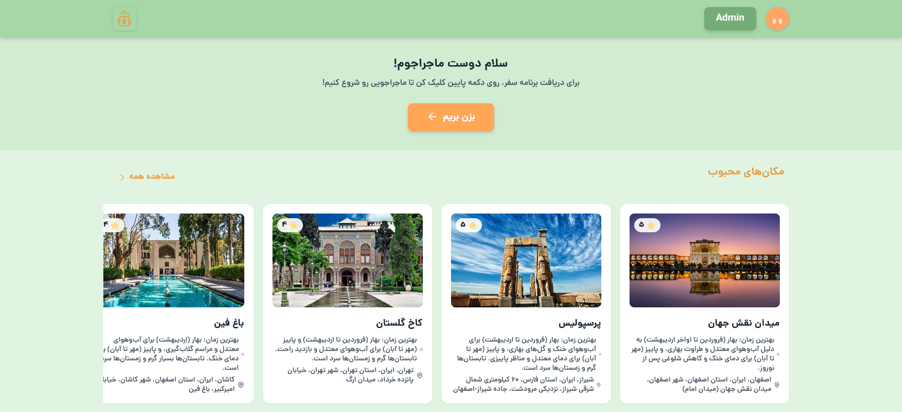
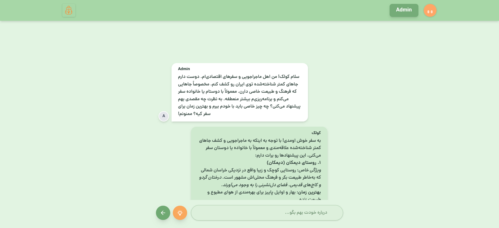
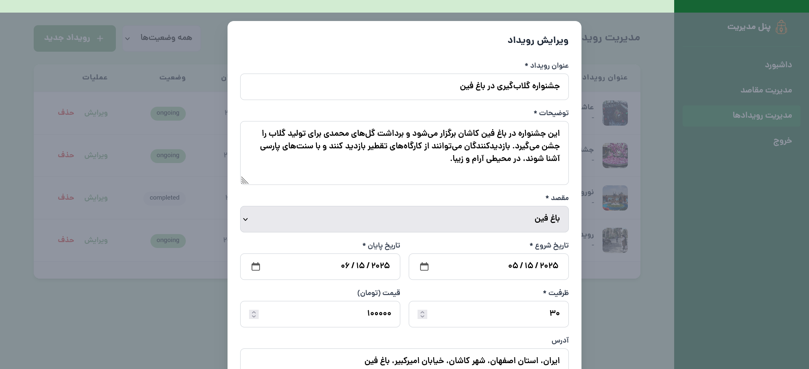

# Kolehbar – AI-powered Travel Planner

Kolehbar is an intelligent web app that provides personalized travel plans based on users' personality, conditions, and budget using artificial intelligence.

---

## Project Overview

Travel planning can be confusing and fragmented. Kolehbar solves this by offering tailored local events, destinations, and travel itineraries customized for each user.

---

## Technologies Used

  
  
   

---

## Features

- Destination selection and local event suggestions  
- Personalized travel itinerary generation  
- Responsive and user-friendly design  

---

## My Role

Full-stack development using Laravel.

---

## Project Status

Currently in development and at MVP stage.

---
## Screenshots

### Homepage

### Kolak AI Travel Assistant

### Admin Dashboard – Events Panel

---
## Contact

**Fatemeh Shahrabi Farahani**  
  

